# Undergraduate Project — Task-Vector Arithmetic & Model Unlearning

This repository contains experiments and utilities for exploring task-vector arithmetic applied to CLIP models. The main goal is to investigate machine unlearning by subtracting task vectors, also exploring adding task vectors.

The project contains three versioned experiment tracks: `v1`, `v2`, and `v3`.

Key ideas
- Task vector arithmetic: create a task vector by taking the difference between a finetuned model/adapter and the pretrained base, then add or subtract scaled task vectors to produce new models.
- LoRA adapters (v1/v2): use parameter-efficient adapters as task vectors and perform adapter-level arithmetic.
- Dense arithmetic (v3): operate directly on full model weights via dense weight arithmetic.

## Versions Overview

- **`v1` — LoRA single-dataset experiments**: Train LoRA adapters on a single dataset and evaluate subtracting a task vector to unlearn a class subset.
- **`v2` — LoRA multi-dataset / adapter arithmetic**: Train adapters that cover multiple datasets/classes and test adapter-level linear arithmetic (mixing, add/subtract) to study interference.
- **`v3` — Dense arithmetic**: Fine-tune the full model weights on different subsets and perform weight-space arithmetic. This version showed good results when removing 10 classes from a 100-class task.

## Repo Structure

- `v1/`, `v2/`, `v3/` — versioned experiments, each with training, test, and helper scripts.
	- Each version contains:
		- `train_*.py` — training scripts
		- `test_*.py` — evaluation scripts
		- `split_data.py` — dataset split utilities
		- `experiments/` — short experiment runner scripts (e.g. `addition.py`, `subtraction.py`)
		- `utils/` — helper utilities like `constant.py`, `merge_csv.py`, `count_class.py`
- `images/` — plots and results used in the README
- `requirements.txt` — Python dependencies

## Getting Started (Quick)

1. Create and activate a Python environment (recommended: `venv` or `conda`).

```
# venv or conda
pip install -r requirements.txt
```

2. Pick a version folder and run an experiment. Example: run v3 addition experiment:

```powershell
cd v3
python experiments/addition.py
```

Common experiment scripts: `addition.py`, `subtraction.py`

1. Outputs are saved to `output/` (per-experiment subfolders) and evaluation CSVs can be merged using the `utils/merge_csv.py` helpers inside each version.

## Typical Workflows

- Train a LoRA adapter (v1/v2): run the training script in the chosen version, which saves an adapter folder. Use the version's `task_vector` or `adapter_arith` utilities to compute differences and compose adapters.
- Fine-tune CLIP (v3): run `v3/train_clip.py` to finetune and save a `save_pretrained` directory. Use `v3/task_vector.py` for dense weight arithmetic.
- Evaluate: run the relevant `test_*.py` script for the version you used.

## Results

### v1
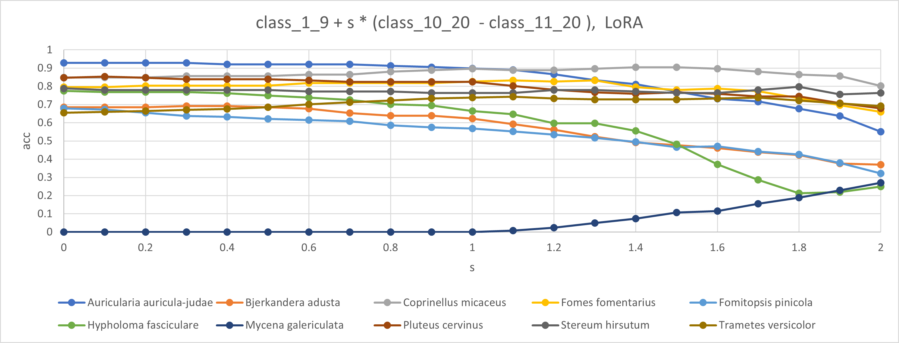
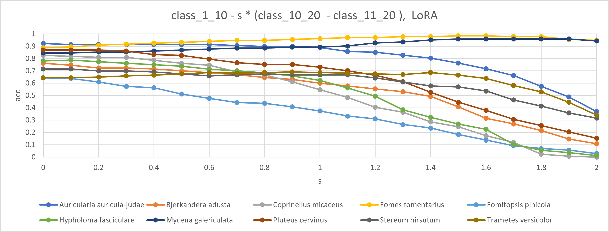

### v2
<table><tr>
<td>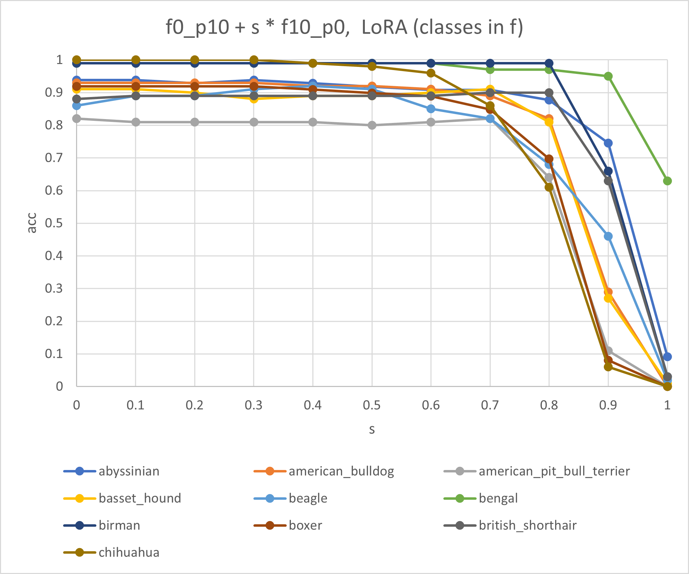</td>
<td>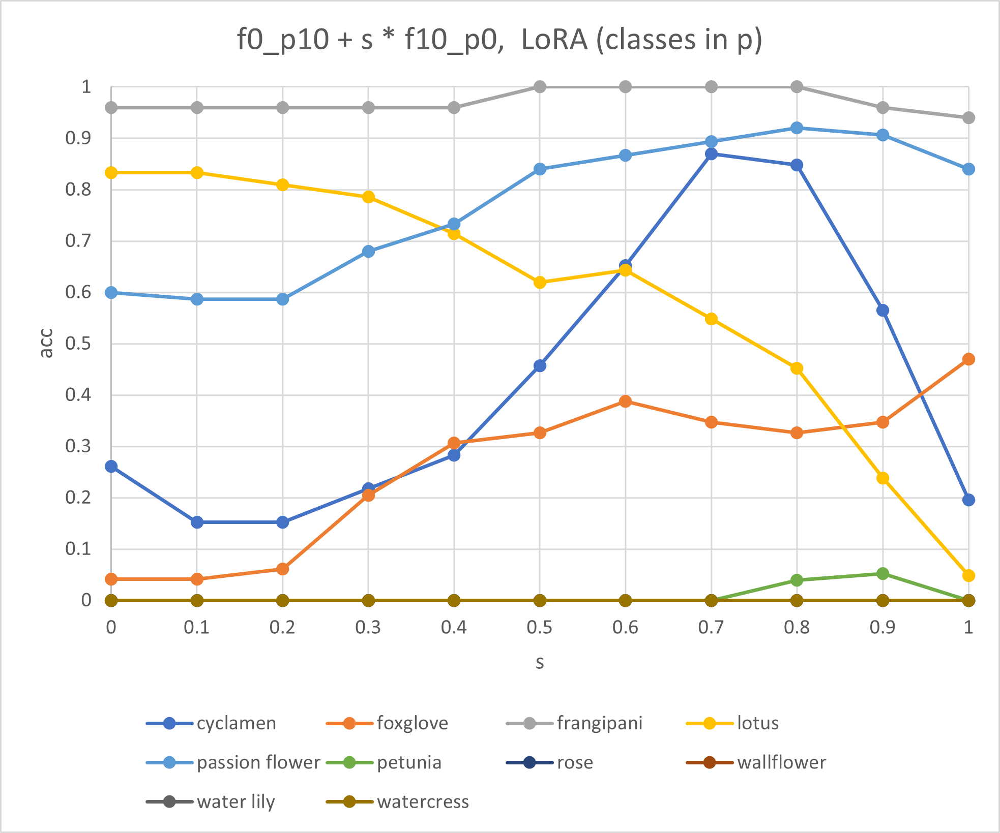</td>
</tr></table>
<table><tr>
<td>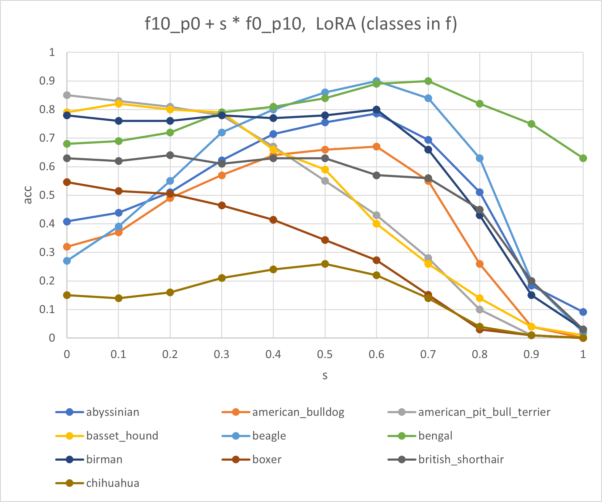</td>
<td>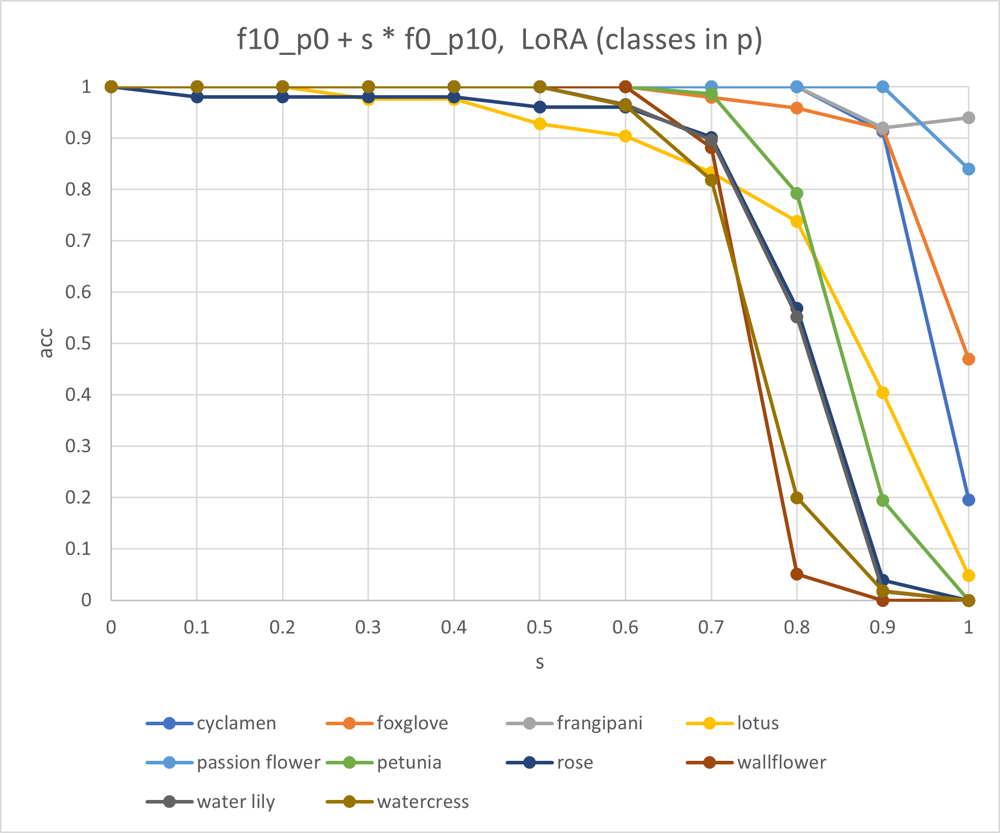</td>
</tr></table>
<table><tr>
<td>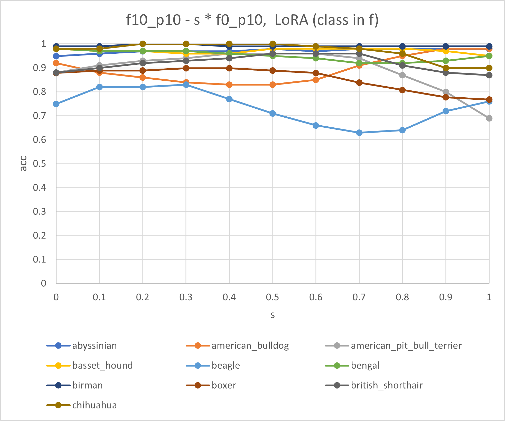</td>
<td>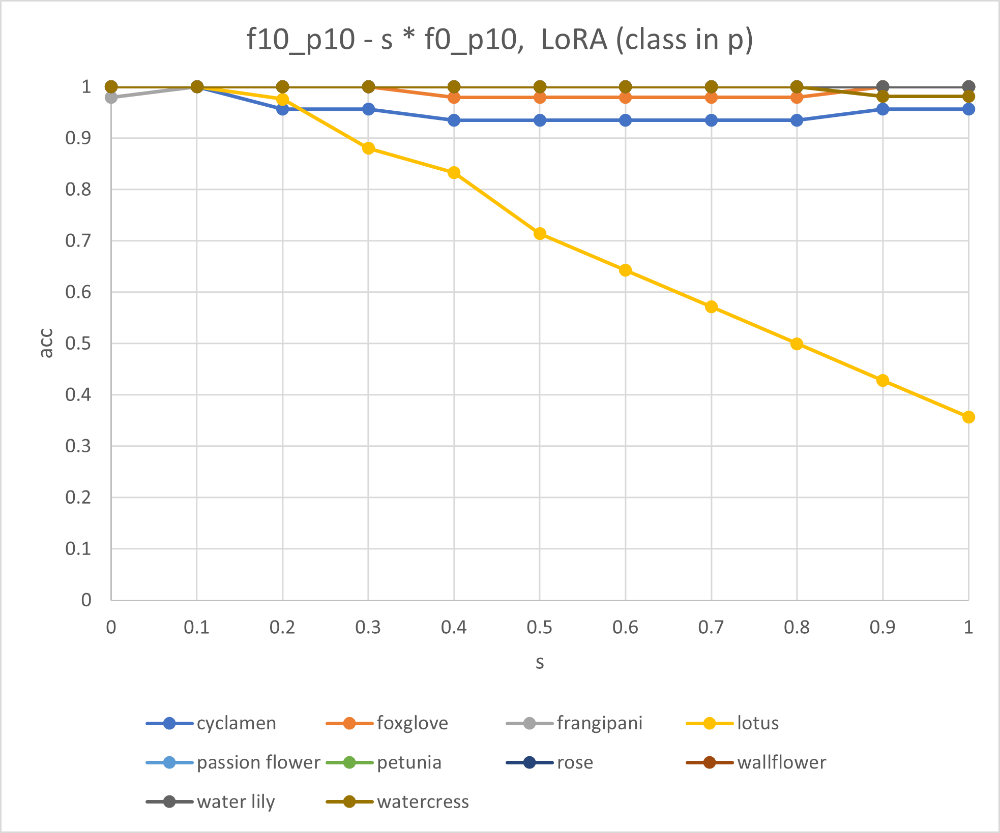</td>
</tr></table>
<table><tr>
<td>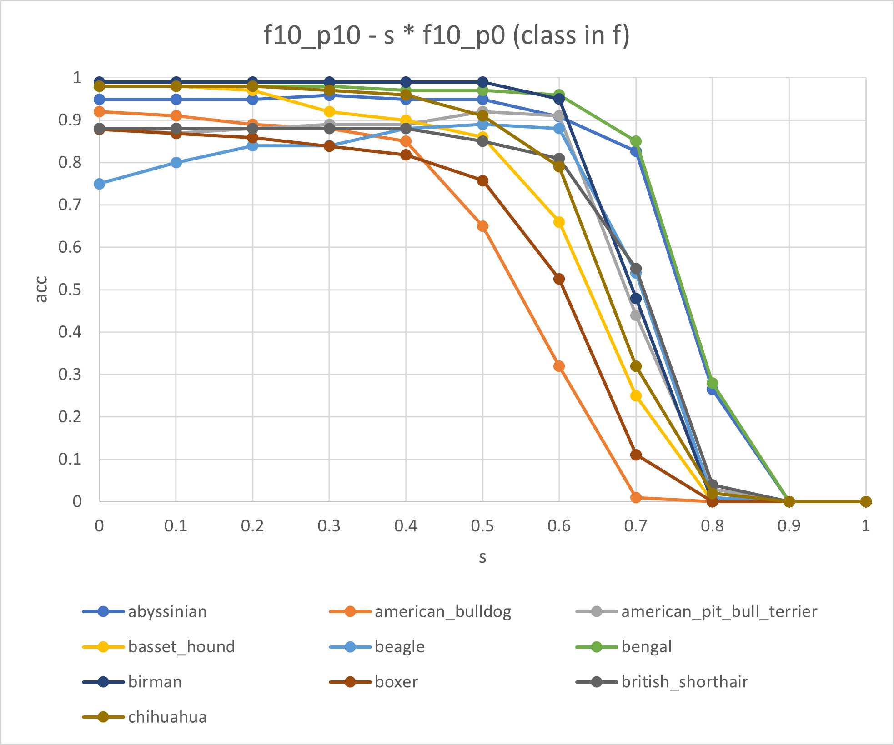</td>
<td>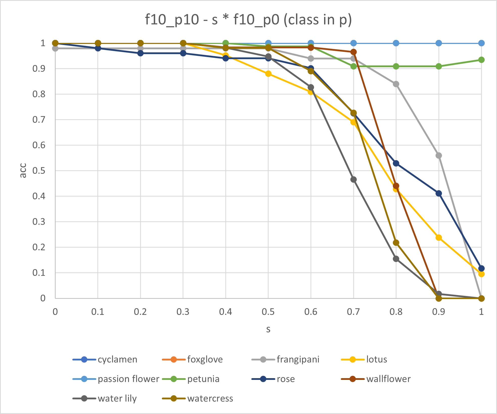</td>
</tr></table>

### v3
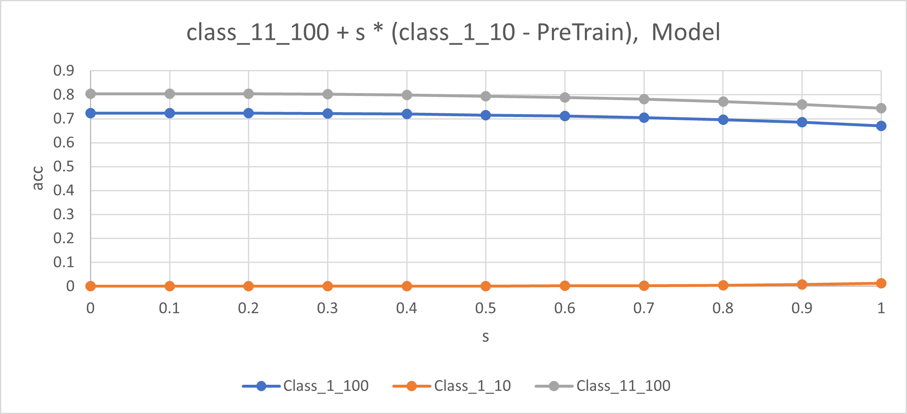
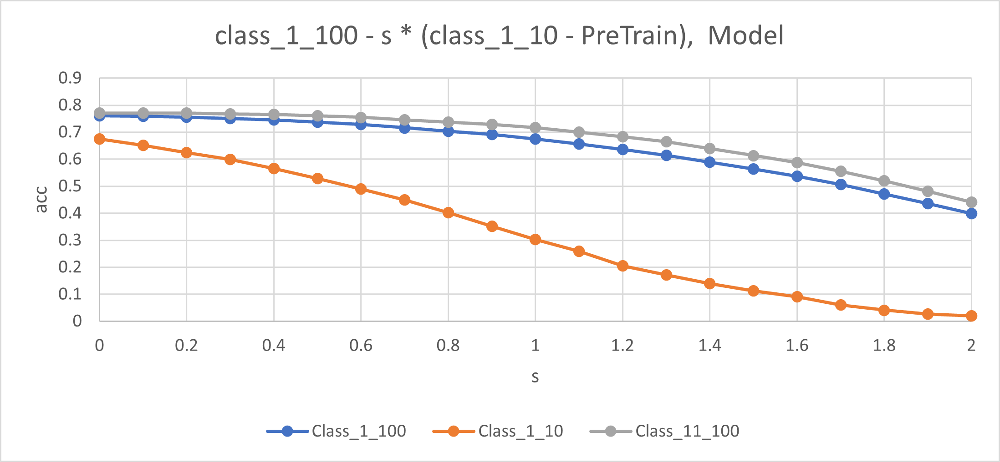

## Notes & Tips

- Check `utils/constant.py` in each version for dataset paths and model names; update paths to point to your local datasets if needed.
- Use CUDA/GPU when available — reduce `batch_size` if GPU memory is limited.
- When performing dense arithmetic, ensure keys/shapes match; `v3/task_vector.py` performs operations only on common keys and warns on mismatches.